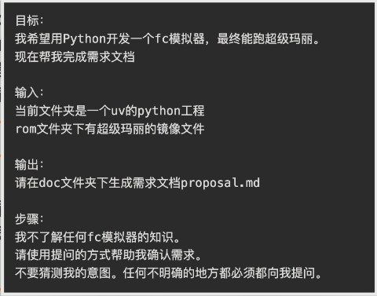
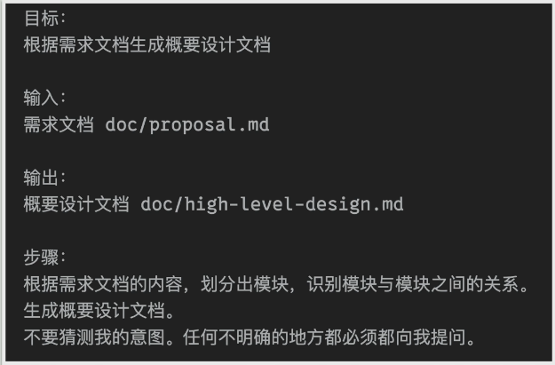
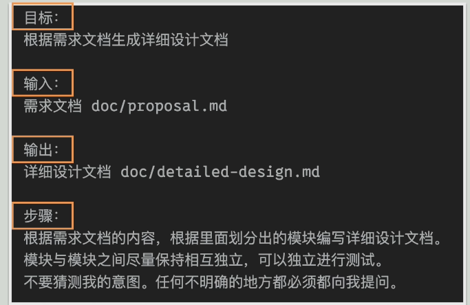
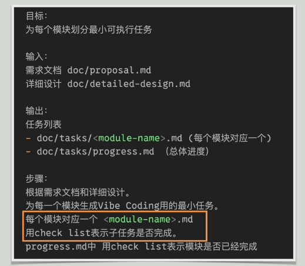
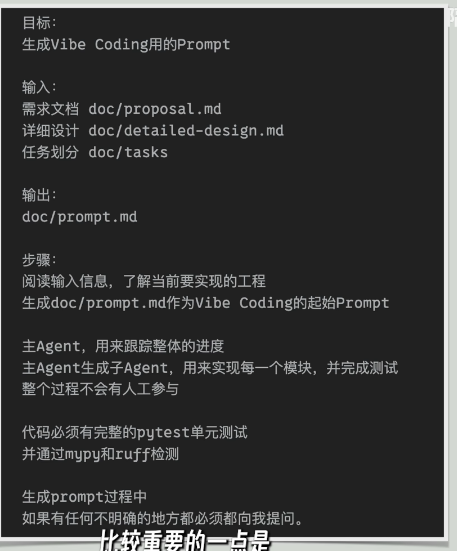

# AI 编程方法论

## 概述

记录和总结 Agent Coding 的方法实践，提升相关能力。

## 主要思想

**Ralph Loop**：

- 文章：[everything is a ralph loop](https://ghunhttps://ghuntley.com/loop/tley.com/loop/)

| 作者观点                   | 你可以怎么用在 Codex                                    |
| -------------------------- | ------------------------------------------------------- |
| 一切都是 loop              | 不要期待一次 prompt 完成复杂功能，而是让 Codex 分轮推进 |
| 每轮只做一个任务           | 大改动拆成小任务，避免 1000 行失控 diff                 |
| 规格比 prompt 更重要       | 把需求写进 specs/、README、AGENTS.md、PLANS.md          |
| 测试是反压                 | 每轮必须跑测试、lint、type check 或最小验证             |
| 观察失败模式               | Codex 犯错后，不只是改代码，还要改规则和提示词          |
| 不急着 multi-agent         | 先把单 Agent + 单仓库 + 单任务循环跑顺                  |
| 工程师不是消失，而是换位置 | 从“写每行代码”变成“设计循环和验收系统”                  |

- 思想：

  以后使用 Codex/Claude Code 这类 Agent，不应该只是“让它帮我写代码”，而应该把它放进一个由规格、计划、测试、审查、提交记录组成的工程循环里。工程师的核心工作，是设计和调优这个循环。

- 落地方案：

  ```markdown
  AGENTS.md：写长期工程规则
  docs/specs/：写功能规格
  docs/plans/：写执行计划
  tests/：提供反压

  Codex：每次只执行一个明确任务
  Review：专门反向审查上一轮输出
  ```

## 实践参考

- 编程语言建议：

  - Python 与 JavaScript：AI 编程最拿手的语言。
  - Rust：语法严格。

- 步骤：

  通过将关键的信息保存在文件中，让每一次 AI 会话都尽量少做事情。

  - 确定需求——与 AI 进行讨，例如：

    

  - 概要设计（如果前一步已经有了，可以考虑省略）

    

  - 详细设计

    

  - 划分任务

    

  - 实现

    

  - 将提示词直接 @ 给 Agent
