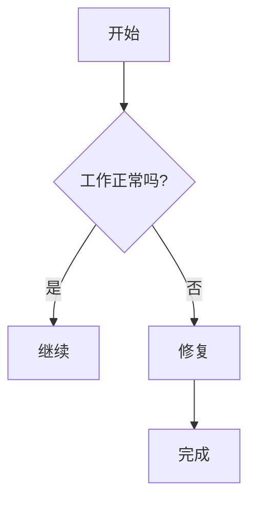
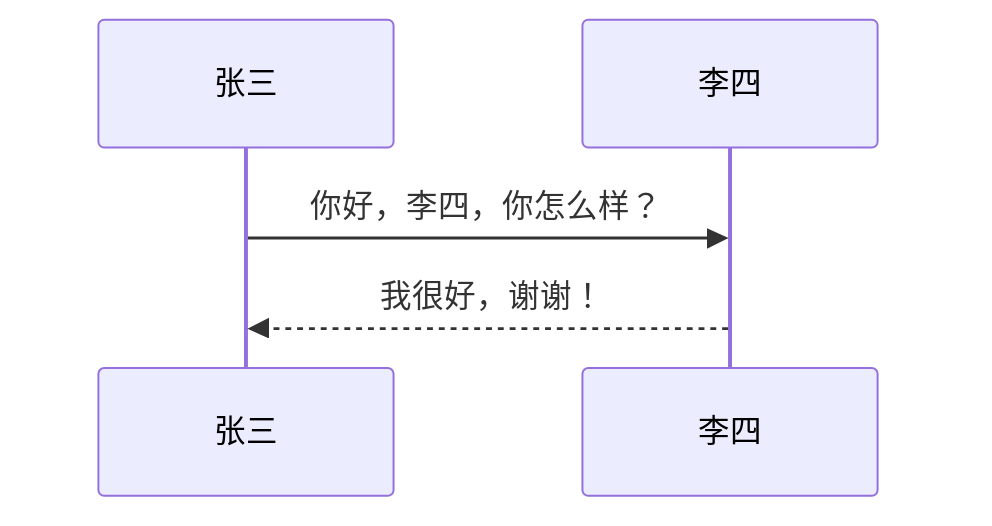
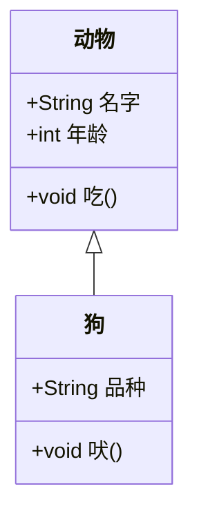
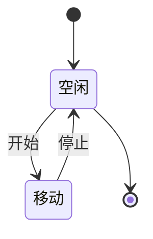
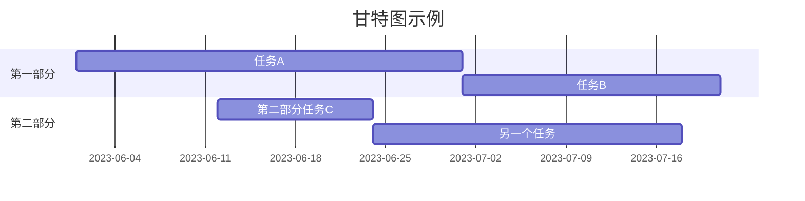

# 示例

## 流程图

```mermaid
flowchart TD
    A[开始] --> B{工作正常吗?}
    B -->|是| C[继续]
    B -->|否| D[修复]
    D --> E[完成]
```

## 时序图

```mermaid
sequenceDiagram
    participant 张三
    participant 李四
    张三->>李四: 你好，李四，你怎么样？
    李四-->>张三: 我很好，谢谢！
```

## 类图

```mermaid
classDiagram
    class 动物 {
        +String 名字
        +int 年龄
        +void 吃()
    }
    class 狗 {
        +String 品种
        +void 吠()
    }
    动物 <|-- 狗
```

## 状态图

```mermaid
stateDiagram
    [*] --> 空闲
    空闲 --> 移动 : 开始
    移动 --> 空闲 : 停止
    空闲 --> [*]
```

## 甘特图

```mermaid
gantt
    title 甘特图示例
    dateFormat  YYYY-MM-DD
    section 第一部分
    任务A          :a1, 2023-06-01, 30d
    任务B          :after a1  , 20d
    section 第二部分
    第二部分任务C  :2023-06-12  , 12d
    另一个任务    : 24d
```

