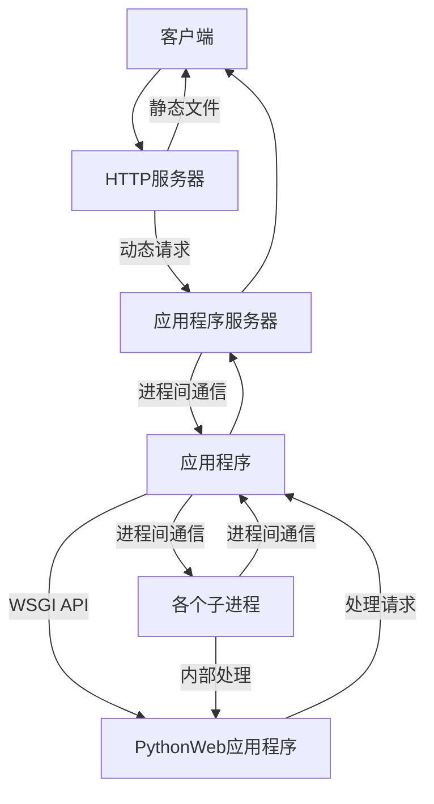

# Python学习

重新绘制这张图，在markdown文件中。

```mermaid
graph TD;
    客户端 --> HTTP服务器;
    HTTP服务器 --> |静态文件| 客户端;
    HTTP服务器 --> |动态请求| 应用程序服务器;
    应用程序服务器 --> |进程间通信| 应用程序;
    应用程序 --> |WSGI API|PythonWeb应用程序;
    PythonWeb应用程序 --> |处理请求| 应用程序;
    应用程序 --> |进程间通信| 各个子进程;
    各个子进程 --> |内部处理| PythonWeb应用程序;
    各个子进程 --> |进程间通信| 应用程序;
    应用程序 --> 应用程序服务器;
    应用程序服务器 --> 客户端;
```

